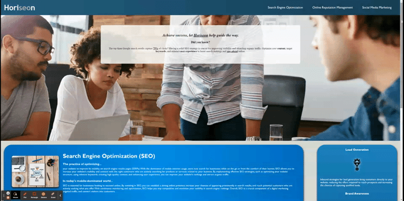

# Code Refactor Starter Code

## How Search Engine Optimization Can Help Your Business Thrive Online

:computer: **Live Deployment**: https://jwilferd10.github.io/Horiseon-Search-Engine-Optimization/

:computer: **Github Repository**: https://github.com/jwilferd10/Horiseon-Search-Engine-Optimization

## :open_file_folder: Table of Contents:
  - [Preview](#camera-preview)
  - [Demo](#movie_camera-demo)
  - [Description](#wave-description)
  - [User Story](#book-user-story)
  - [Resources Used](#floppy_disk-resources-used)
  - [Contact Information](#e-mail-contact-information)

## :camera: Preview:

## :movie_camera: Demo:

## :wave: Description: 
Web accessibility is an increasingly important consideration for businesses. It ensures that people with disabilities can access a website using assistive technologies such as video captions, screen readers, and braille keyboards. Making a website accessible is also good for business for many reasons, one of them being that accessible sites are better positioned in search engines like Google. It also helps companies avoid litigation that can occur when people with disabilities can't access their website.

Horiseon underwent a comprehensive refactoring process as part of my initial challenge during the UCLA Coding Bootcamp. This project aimed to simulate a real-world scenario where the goal was to enhance the website's accessibility. Various improvements were implemented, including the integration of semantic HTML elements and the consolidation of CSS for streamlined maintenance. 

Moreover, the HTML structure was redesigned to adhere to a more logical and coherent layout, ensuring optimal navigation and readability. Each image now includes descriptive alt attributes, enhancing both usability and compliance with web accessibility standards. Additionally, the headings were restructured to follow a sequential order, further improving the site's overall accessibility and user experience. These enhancements reflect a professional approach to web development, demonstrating the importance of accessible design principles and code optimization.

The base project for Horiseon was completed at commit 768dd21. Any changes made after that point are additional modifications implemented post bootcamp. The primary objective of these updates was to give Horiseon a more modern design and ensure its accessibility on mobile devices. By incorporating responsive design principles and optimizing the layout, Horiseon now offers improved usability and visual appeal on both desktop and mobile platforms. These enhancements enable Horiseon to effectively engage a broader audience and stay true to being accessible.

Thank you for checking this site out! 

## :book: User Story:
**AS A marketing agency**
- I WANT a codebase that follows accessibility standards
    - SO THAT our own site is optimized for search engines

**GIVEN a webpage meets accessibility standards**
- WHEN I view the source code
    - THEN I find semantic HTML elements
- WHEN I view the structure of the HTML elements
    - THEN I find that the elements follow a logical structure independent of styling and positioning
- WHEN I view the image elements
    - THEN I find accessible alt attributes
- WHEN I view the heading attributes
    - THEN they fall in sequential order
- WHEN I view the title element
    - THEN I find a concise, descriptive title
  
## :floppy_disk: Resources Used:
- HTML
- CSS
  
## :e-mail: Contact Information:
- ### [jwilferd10](https://github.com/jwilferd10)
